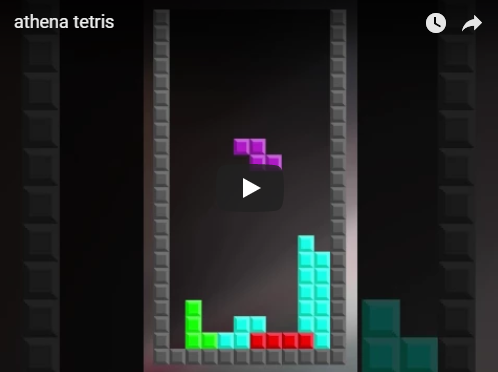

# A Tetris game written using AthenaJS

[](https://www.youtube.com/watch?v=zvzP5iCjdsE "Tetris")

Athenajs-tetris is a simple tetris game written using AthenaJS.

The game was designed while developing the [AthenaJS](https://github.com/AthenaJS/athenajs) framework and demnonstrates how to use
Map & Tiles to easily create a game.

## Demo

Head over to [https://athenajs.github.io/athenajs-tetris/](https://athenajs.github.io/athenajs-tetris/) for a demo.

## Installation

```
npm install && npm start
```

This will install dependencies, build athenajs-tetris and start a development server at `http:/127.0.0.1:8888`

## License

Copyright (c) Nicolas Ramz.

Licensed under the [MIT](LICENSE) License.